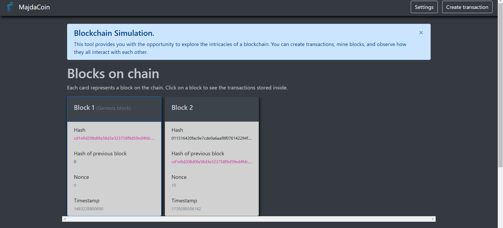

# MajdaCoin

This is the **MajdaCoin** project, a web application designed for cryptocurrency simulation. The project was built using Angular, and it provides an interface for users to interact with a mock cryptocurrency platform.

## Features

- **Interactive UI**: The app offers a user-friendly interface for simulating cryptocurrency transactions.
- **Responsive Design**: It works seamlessly across different devices and screen sizes.
- **Real-Time Data**: Simulate cryptocurrency data to understand how the market behaves.

## Installation

-> Ensure that you have Node.js and npm installed:

Node.js: Required for running the development server and managing dependencies.
npm: Used for managing dependencies and running scripts

-> To run the project locally, follow these steps:

1. Clone the repository:
   ```bash
   git clone https://github.com/Majda8/Blockchain_Simulation.git
   ```

2. Install the dependencies:
   ```bash
   cd Blockchain_Simulation
   npm install
   ```

3. Run the app:
   ```bash
   ng serve
   ```

4. Open the app in your browser at `http://localhost:4200`.

## Screenshots

Here is a preview of the application interface:



## Technologies Used
- **Angular**: The main framework used for building the application.
- **Node.js**: Required for running the development server and managing dependencies.
- **npm**: Used for managing dependencies and running scripts.

## License
This project is licensed under the MIT License.

